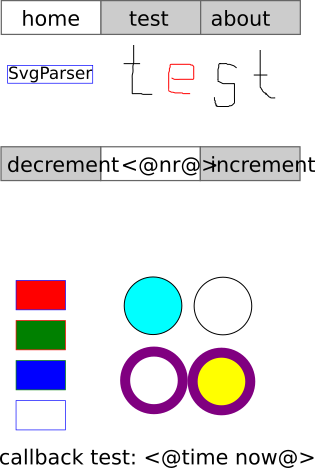
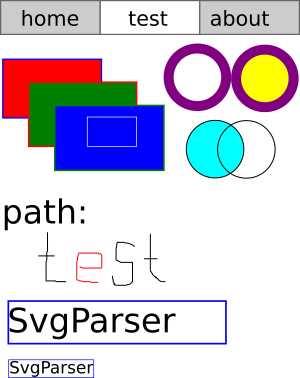

# embeddedSvg
This project implements a basic SVG parser for GUI applications on ESP8266 based devices. The GUI can be output on a display (with touch) or as a website.
Currently it supports the TFT_eSPI display driver, but it can be very easily ported to other displays!

The following SVG elements are supported right now: svg, rects, circles, text, tspan, g (group), path, a (link).

In order to add live content to the output on the display, a callback mechanism is implemented. A specified tag is replaced by the return value of a function provided by the user program.

Touch displays are supported. With them, the link system can be used. Links to other SVGs can be executed automatically. The callback system applies also to the link system.

These two SVGs are used as test patterns:




In the user programm, the callbacks can be added like this:

```javascript
int counter = 42;

char * increment(int argc, char* argv[]) {
  counter++;
  return NULL;
}
char * decrement(int argc, char* argv[]) {
  counter--;
  return NULL;
}

char * printCounter(int argc, char* argv[]) {
  char *ptr = (char *)malloc(10);
  if (ptr == NULL) return NULL;
  sprintf(ptr, "%i", counter);
  return ptr;
}

...
// first, create an instance of the output class. Here the TFT_eSPI driver is used:
SvgOutput_TFT_eSPI svgOutput = SvgOutput_TFT_eSPI();
// this output instance is passed to the SvgParser:
SvgParser svg = SvgParser(&svgOutput);

// register callbacks:
svg.addCallback("nr", printCounter);
svg.addCallback("dec", decrement);
svg.addCallback("inc", increment);

// read and output file:
svg.readFile((char *)"/index.svg");
svg.print();

// here, all the work is done:
for(;;){
  if (tft.getTouch(&x, &y)) {
    if (svg.onClick(x, y, &link)) {
      Serial.printf("pressed: #%s#\n", link);
      free(link);
    }
  } 
}
```

This will replace the text in the box inbetween increase and decrease.
The boxes behind increase and decrease are links with href:index.svg?dec and index.svg?inc

When pressing the links, the callback function is executed and the display is beeing refreshed. 
The value on the screen changes accordingly.

The second test page is used to check the order of elements:



